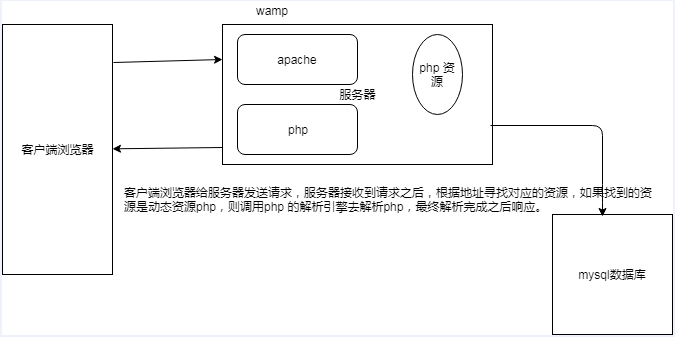

## HTTP服务&AJAX编程

### 软件架构

``` cs 架构流程图 ```

 


### 客户端

具有向服务器索取服务能力的终端，通过安装不同的软件来获取不同的服务。

### 服务器

对外提供服务的超级计算机，通过安装不同的软件提供不同的服务.

它要提供什么服务器，取决于它安装什么类型的软件.

## 网络基础

###IP 

主机的的一个唯一表示，通过这个ip 可以找到这台计算机.

局域网ip：某一区域内由多台计算机互联成的计算机组 ，使用路由器或者交换机连接.

公网ip:公网ip 是需要去运营进行申请。 有一个固定的ip 地址。

### 域名

由于IP地址基于数字，不方便记忆，于是便用域名来代替IP地址，域名是一个IP地址的“面具”

查看域名对应的IP地址 ping、tracert。

需要去申请。万网. 域名类型 .com  .cn  .net  .gov

### DNS服务

DNS记录了 IP 地址和域名的映射（对应）关系；

查找优先级 本机hosts文件、DNS服务器。

### 端口

端口号是计算机与外界通讯交流的出口，每个端口对应不同的服务。

查看端口占用情况 netstat -an。

常见端口号 80、8080、3306、21、22。

计算机大概有6w 多个端口.

搭建一个服务器，对外提供服务器。

计算机+操作系统(windows,linux,unix)+web 服务器(安装这种web 应用功能软件去对外提供服务)

apache,tomcat,weblogic ,jboss,nginx。

### Web服务器

即网站服务器，主要提供文档(文本、图片、视频、音频)浏览服务，一般安装Apache、Nginx服务器软件。

HTTP服务器可以结合某一编程语言处理业务逻辑，由此进行的开发，通常称之为服务端开发。

常见的运行在服务端的编程语言包括 PHP、Jsp、Asp、Python、Ruby, go,node.js等。

##搭建 web 服务器 

Windows (Linux) + Apache + Mysql + PHP，首字母组合

### 安装WampServer

安装wampserver，和普通软件安装无差别，除指定安装路径外，其它默认安装。

### 管理HTTP服务

任务图标绿色为正常启动状态

通过图形控制台可以启动、重启、停止所有服务


或者单独启动、重启、停止特定服务


**注意事项：**

1、检查网络是不是通的 ping 对方IP

2、检查防火墙是否开启，如果开启将不能正常被访问

3、检查访问权限 Allow from all  235 行

4、理解默认索引

5、确保端口没有被其它程序占用

6、“#”表示注释

7、修改配置要格外小心，禁止无意修改其它内容

###  配置根目录 

网站根目录是Web服务器上存放网站程序的空间，可通过修改配置文件自定义，如E:/www

具体步骤如下 （178行，205 行）

1、打开配置文件，控制台选择


或者 wampserver安装目录下

bin\apache\Apache2.2.21\conf\httpd.conf

2、设定根目录，查找并修改

 

例如：

 

这样就指定了 "E:/www/"为存放网站的根目录。

3、配置根目录，查找

 

修改成 

 

4、修改完后，并不能立即生效，需要重启Apache

注：可以指定任意目录为根目录

###  网站部署

将我们制作好的网页拷贝到配置好的根目录下，浏览器访问127.0.0.1即可。

访问 www.tianmao.com /www.jd.com 到我指定的服务器的一个页面里面去

###  配置虚拟主机

在一台Web服务器上，我们可以通过配置虚拟主机，然后分别设定根目录，实现对多个网站的管理。

具体步骤如下：

1、开启虚拟主机辅配置，在httpd.conf 中找到

 

去掉前面的#号注释，开启虚拟主机配置

2、配置虚拟主机，打开conf/extra/httpd-vhosts.conf 

 

分别修改以下三项

DocumentRoot "E:/www/example"

ServerName "example.com "

ServerAlias "www.example.com"

其它项无需指定。

3、修改DNS（hosts）文件

打开C:\Windows\System32\drivers\etc\hosts

目录是固定的

 

注：修改hosts文件权限

4、重启Apache

5、浏览器访问www.example.com

我们放问http://www.jd.com

实际上首先会去找  C:\Windows\System32\drivers\etc\hosts文件.

找到之后会根据这个里面的一些映射去进行查找.

根据127.0.0.1       jd.com
127.0.0.1       www.jd.com

127.0.0.1       tianmao.com
127.0.0.1       www.tianmao.com

进行匹配到，如果匹配到了 127.0.0.1 地址.

没有就只服务访问dns 服务器


### 静态资源 与动态资源

静态资源：可以直接被浏览器解析的资源我们称为静态资源，比如html,javascript,css,video 等。

动态资源:动态资源在服务器被解析，可以被转换为静态资源。 

区别：如果我们客户端浏览器访问的是静态资源，那服务器接收到请求后，会直接将静态资源响应给客户端。

如果客户端浏览器访问的是动态资源，那么服务器接收到请求后会将动态资源转换成静态资源，然后进行响应。




## php 编程

### php 入门

文件以.php后缀结尾，所有程序包含在

### php 变量

1、变量以$开头 字母/数字/下划线 不能以数字开头

2、大小写敏感（区分大小写）

### 数据类型

字符型、整型、浮点型、布尔型、数组、

索引数组、关联数组（了解即可）

### 内容输出

echo：输出简单数据类型，如字符串、数值

print_r()：输出复杂数据类型，如数组

var_dump()：输出详细信息，如对象、数组（了解）

### 运算符

基本与Javascript语法一致

.号表示字符串拼接符，Javascript中为+号。

### 函数

与Javascript基本一致函数名对大小写不敏感默认参数（了解即可）。

### 分支 循环语句

与Javascript基本一致foreach()

### 表单处理

表单name属性的是用来提供给服务端接收所传递数据而设置的

表单action属性设置接收数据的处理程序

表单method属性设置发送数据的方式

当上传文件是需要设置 enctype="multipart/form-data"，且只能post方式

$_GET接收 get 传值

$_POST接收 post 传值

$_FILES接收文件上传

### 常用PHP函数

in_array() 是否在数组中

```
$arrs=array("1","2","3");
//判断1 这个元素是否存在$arrs 这个数组当中。
echo in_array("1",$arrs);
```

count() 计算数组长度

```
$arrs=array("1","2","3");
count($arrs);
```

array_key_exists ()检测数组中是否存在key

```
 $arrs=array("username"=>"张三","age"=>11);
echo array_key_exists("username",$arrs);
```

file_get_contents读取文件

...还有很多

```
$data=file_get_contents("hello.txt");
echo $data;
```

### 文件上传

#### 文件上传客户端的要求

- 必须表单提交
- 必须是post 方式提交
- 当上传文件是需要设置 enctype="multipart/form-data"
- 必须有一个input  type=file 的属性

#### 文件上传服务器处理数据

使用$_FILES接收文件上传 接收文件上传的数据。move_uploaded_file

 $data=$_FILES[**"lifephoto"**];
*// var_dump($data);**//**获取到**apache* *临时存储的文件**.*$file=$data[**"tmp_name"**];
//获取到文件名 $fileName=$data[**"name"**];
**move_uploaded_file**($file,**"images/"**.$fileName);

```
header("Content-Type:text/html;charset=utf-8");          
 1:怎么去接收文件上传的数据 实际上就是去这个数组里面把客户端传递的文件内容一个一个取出来
                 //var_dump($_FILES);
接收到的是文件上传的数据. lifephoto 是文件上传的参数的名称
   $_FILES=array(
       "lifephoto"=>
       array(
       name=>"", 客户端传递的文件的名称
       type=>"image/jpeg", 客户端传递的文件类型
       tmp_name=>"",  客户端传递的文件在服务端临时的一个保存地址
       error=>"0"  文件上传的时候可能会发生失败，出错误
       size=>"10823" 客户端上传的 文件的大小
       )
   );
1.1 获取文件上传的数据
 $fileName=$_FILES["lifephoto"]["name"];
1.2 获取文件上传的时候在服务器端临时的存储位置
$tmpaddress=$_FILES["lifephoto"]["tmp_name"];
2：接收到文件上传的数据之后，我们怎么去处理这些数据.，实际上要把客户端上传的数据保存在服务端的硬盘上面.
2.1 怎么去保存，php 提供了一个函数 move_uploaded_file，可以将文件上传的数据移动到指定的某个目录文件下面接收两个参数
1:临时的文件存放的地址
2:我要放在的目标位置, images/1.jpg
move_uploaded_file($tmpaddress,"images/".$fileName);
3：响应数据
echo "<font color='green'>恭喜你，文件上传成功</font>";
```


### 作业

登录案例:

​		客户端：表单提交用户名，密码 

​		密码：如果用户名是sunxiaomeng  密码是 123456  则输出欢迎欢迎，如果不是则输出用户名或者密码错误。（有基础的同学可以连接到数据库这一层）;

​		

