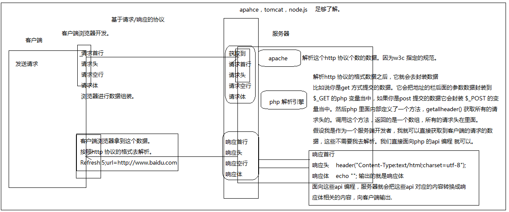
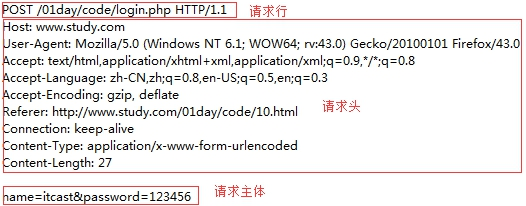
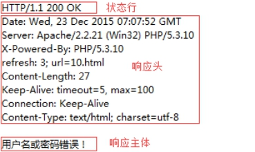
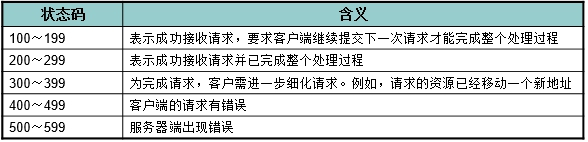

## HTTP服务&AJAX编程

- ## 网络通讯协议

  指服务器和客户端间进行通信时的约束和规范，客户端与服务端的数据交互并不是杂乱无章的，需要遵照（基于）一定的规范进行。

  ###常见协议

  1、HTTP、HTTPS 超文本传输协议 

  2、FTP 文件传输协议

  3、SMTP 简单邮件传输协议

  4、即时通讯协议XMPP

  ### http 协议 

  即超文本传输协议，网站是基于HTTP协议的，例如网站的图片、CSS、JS等都是基于HTTP协议进行传输的。

  HTTP协议是由从客户机到服务器的请求(Request)和从服务器到客户机的响应(Response)进行了约束和规范。

  即HTTP协议主要由请求和响应构成。 44.png

  

  常用请求方法 POST、GET、PUT、DELETE

  ###  **请求/请求报文**

  请求由客户端发起，其规范格式为：请求行、请求头、请求主体。

   

  1、请求行

   

  由请求方式、请求URL和协议版本构成

  2、请求头

  Host：localhost请求的主机

  Cache-Control：max-age=0控制缓存

  Accept：*/* 接受的文档MIME类型

  User-Agent：很重要

  Referer：从哪个URL跳转过来的

  Accept-Encoding：可接受的压缩格式

  3、请求主体

  即传递给服务端的数据

  **注：当以post形式提交表单的时候，请求头里会设置**

  **Content-Type: application/x-www-form-urlencoded，以get形式当不需要**

  ### **响应/响应报文**

  响应由服务器发出，其规范格式为：状态行、响应头、响应主体。

   

  1、状态行

   

  由协议版本号、状态码和状态信息构成

  2、响应头

  Date：响应时间

  Server：服务器信息

  Content-Length：响应主体长度

  Content-Type：响应资源的MIME类型

  **MIME是标识文件类型的，文件后缀并不能正确无误的标识文件的类型。**

  **客户端与服务器在进行数据传输的时候都是以字节形式进行的，咱们可以理解成是以“文本形式”传输，这时浏览器就需要明确知道该怎么样来解析这些文本形式的数据，MIME就是明确告知浏览器该如何来处理。**

  3、响应主体

  即服务端返回给客户端的内容；

  状态码

   

  常见的有200代表成功、304文档未修改、403没有权限、404未找到、500服务器错误,302 代表的是请求重定向。

  ####**调试工具**

  利用HTTP抓包工具在开发中可以帮我们进行调试，常用抓包工具HttpWatch、Fiddler、Charles、FireBug等

  **浏览器插件**

  Firebug、HttpWatch、chrome dev tools

  **代理软件**

  Charles、Fiddler

  #### 特殊的请求头以及响应头介绍

  ```
  请求头
  User-Agent: 告诉服务器，客户端的浏览器的版本
  Content-Type:application/x-www-form-urlencoded post 提交独有的请求头，如果发送到服务器的数据是中文，会对数据进行编码.
  Referer:http://localhost/index.html 告诉服务器，客户端的请求来自于那个页面.
  响应头:
  告诉客户端浏览器
  Content-Type:text/html;charset=utf-8;
  Refresh:告诉客户端浏览器过几秒之后重新刷新.
  常见的请求状态吗:
  200  ok
  403  没有权限访问
  404  请求的资源没有找到 
  304  后端的文件的没有任何的改变 
  302  重定向 
  500  服务器内部错误.
  ```

  

  ####get 请求与post 请求介绍

  	1: get 发送的数据都在地址栏当中，不安全
  	2：get 发送的数据对数据大小由限制。
  	3：get 没有请求体
  	4：post 发送的数据在请求体当中，相对安全
  	5：post 对请求的数据的大小没有限制
  	6：post 有一个特殊的请求头 Content-Type:application/x-www-form-urlencoded
  	7: get 的请求头相对较少，性能稍微要高一些.

```
案例1
        //解决乱码，给客户端一个响应头
        header("Content-Type:text/html;charset=utf-8");
        //1:获取请求头 获取所有的请求头.
          $arrHeader=getallheaders();
        //2:我获取的是User-Agent 请求头对应的值
          $headeValue=$arrHeader["User-Agent"];
         // echo $headeValue;
        //3:php 里面有一个函数 strstr() 判断字符串是否包含指定的字符串.
        if(strstr($headeValue,"Chrome")){
             echo "您当前使用的google 浏览器，棒棒哒!";
        }else if(strstr($headeValue," Firefox")){
             echo "您当前使用的火狐 浏览器，双击666";
        }else if(strstr($headeValue,"MSIE")){
             echo "您当前使用的浏览器版本较低，请<a href='http://www.360.com'>升级</a>";
        }
```

```
案例2
<?php
        header("Content-Type:text/html;charset=utf-8");
        //1:给一个响应头
        header("Refresh:5;url=http://www.baidu.com");
        //2：给文字提示.
        echo " <span>5</span> 秒钟之后会自动跳转页面，如果没有跳转，请点击<a 		href='http://www.baidu.com'>这里</a>";
?>
<script>
                var i=5;
                var ids=window.setInterval(function(){
                        i--;
                        if(i==0){
                                window.clearInterval(ids);
                                return;
                        }
                        document.querySelector("span").innerHTML=i;
                },1000);
</script>
```

## 数据库

### 数据库基础知识

数据库：存储数据的仓库 （仓库用来存储的数据） 

内存存储

​	1:数据无法持久化

​	2:无法保存大量的数据

文件存储

​	速度太慢，无法忍受

​	很难确定数据的结构以及关系，增加、删除、修改麻烦，需要你自己按照一种固定的方式

​	不安全，随便一个人都能打开你的文件

### 数据库概述

- **实现数据共享**

不是为某一个用户存储特定的数据

- 可以减少冗余数据
- 数据独立性高
- 数据统一管理与控制 

建立存储数据的

一个数据库服务器中可以有多个数据库

一个数据库当中可以有多张表用来存储数据

一个表中可以用来存储多条记录

### SQL 语言


SQL（Structure Query Language）：结构化查询语言

是一种数据库**查询语言**。

SQL语言是一个标准。由一个规范组织提出和维护的。

市面上常见的数据库基本都支持SQL查询语言。

#### DDL

l 数据定义语言（Data Definition  [ˌdefɪˈnɪʃn]  Language）简称**DDL**

数据库定义语言主要用于定义数据库、表等，其中包括：

CREATE  语句用于创建数据库、数据表等

ALTER   语句用于修改表的定义等

DROP    语句用于删除数据库、删除表等

### DML

l 数据操作语言（Data Manipulation [məˌnɪpjʊ'leɪʃn] Language）简称DML

数据操作语言主要用于对数据进行添加、修改和删除操作，其中包括：

INSERT 语句用于插入数据

UPDATE 语句用于修改数据

DELETE 语句用于删除数据

#### DQL

l 数据查询语言（Data Query Language）简称DQL

数据查询语言主要用于查询数据，也就是SELECT语句，使用SELECT 语句可以查询数据库中一条数据或多条数据

数据库中的操作都是通过SQL语句来完成的，而且在应用程序中也经常使用SQL语句，例如在Node.js中嵌入SQL语句，通过执行JavaScript语言来调用SQL语句，就可以完成数据的插入、修改、删除、查询等操作。

SQL语句还可以嵌入到其它语言中，如Java、PHP等。

### 常见的数据库产品

#### Orcale数据库

Orcale数据库管理系统由**甲骨文公司**开发，在数据库领域一直处于领先地位。

大型的商业型数据库，目前国内一些大公司在用，国企

淘宝、京东等都有使用，一个很老牌的数据库，稳定

#### SqlServer数据库

由微软公司开发，只能在Windows上运行。.net程序员。

但是，微软现在已经把SqlServer移植到了别的平台，例如：Linux

#### DB2数据库

由IBM公司开发，在**金融行业**中使用的比较多。IBM的服务器，买服务器送数据库。

IBM靠硬件发家的，小型机。小型服务器

比较稳定

#### MySQL数据库

MySQL数据管理系统由瑞典的MySQLDB公司开发，但是几经辗转，现在已经是Oracle的产品了。

开源、免费、轻量

MySQL具有跨平台的特性，不仅可以在Windows平台上使用，还可以在Unix、Linux和Mac OSX平台上使用。

相对其它数据库而言，MySQL的使用也更加方便、快捷而且MySQL免费所以**运营成本低**，因此很多公司都在用MySQL。

Oracle收购过来之后，发行了两个版本：

​	一个是企业版，公司买了之后，Oracle公司可以提供一些服务，例如数据恢复，或者说存储数据出现了问题

​	一个社区版，也就是免费开原版

#### MongoDB数据库

mongodb是一种非关系型数据库，简称NoSQL

存储方式，不是数据库-表-记录了

mongod的存储方式是：数据库-集合-实体（随便存储，就像json对象一样）

MongoDB是由10gen公司开发的一个介于关系型数据库和非关系型数据库之间的产品，是非关系型数据库中功能最丰富，最像关系型数据库的。他支持的数据结构非常松散，是类似json的格式，所以可以存储比较复杂的数据结构类型。

MongoDB数据库管理系统最大的特点就是它支持的查询语言非常强大，语法类似于面向对象的查询语言。它还是一个开源的数据库，对于大数据量、高并发的互联网应用，支持非常不错。

操作非关系型数据库不需要使用SQL语言


## MySQL安装与配置

### Windows平台下安装和配置MySQL

官方网站：<http://www.mysql.com/>

 

 

 

 

 

 


 

 

 

 

 

 

 

 

 

 

 

 

 

 

 

 

 

验证mysql是否安装成功：

- 打开命令台，输入services.msc找到mysql服务
- 通过在cmd命令台中输入path查看是否有mysql的bin目录

### MySQL目录结构

bin：可执行文件所在目录

data：数据文件所在目录

Docs：文档目录

share：存放字符集等信息

my.ini：MySQL数据库使用的配置文件

## 1.1 MySQL的使用

### 1.1.1 启动 和 停止MySQL服务

1. 通过Windows服务管理器启动MySQL服务

通过Windows的运行，输入services.msc找到MySQL服务

1. 通过DOS命令启动MySQL服务

   et stop mysql	停止MySQL服务

   et start mysql	开启MySQL服务

### 登录MySQL数据库

**使用相关命令登录**

打开命令台：

mysql -h localhost -P 3306 -u root -p

-h：主机名

-P：端口

-u：用户名

-p：密码

这种方式一般用来连接远程数据库服务器

mysql默认连接localhost和3306，所以可以省略-h和-P

mysql -u root -p

这种方式一般用来连接本机，可以省略-h和-P，默认就是localhost和3306

#### 创建数据库

**CREATE** DATABASE [IF **NOT EXISTS**] db_name;

创建   数据库	数据库名;

注意：一定要在语句的末尾加分号

注意：中括号都表示可选的意思，不是让你把中括号也写进入，否则mysql根本不识别。

#### 查看数据库

show database;

#### 删除数据库

**DROP** DATABASE [IF **EXISTS**] db_name;

#### 选择数据库

USE db_name;

### 数据库表的概念

​       我们的数据是面向表存储的，数据库表格式用来存储数据的，这个我们现实当中的表一样，我们首先需要定义表当中有多少列，然后我们可以往表当中添加一条一条的记录。我们在定义一张表的列时，我们需要先根据需求对这张表进行设计，设计一般主要是设计表当中有哪些列，这一列对应的名称是什么，它所存放的数据类型是什么，这个我们也称为表结构的设计。所以在学习表的设计之前，我们需要学习表的一些相关知识.

##### 数据类型

数据类型是用来约束表当中每一列存放的数据类型。这样做的目的是为了

##### 整数类型


##### 日期和时间


##### 字符串和二进制


### 数据库表的基本操作

#### 创建数据库表

```
CREATE TABLE table_name
(
    field1  datatype,
    field2  datatype,
    field3  datatype,
)
```

#### 查看数据表

查看当前数据库中的所有表。

```
show tables;
```

查看表结构

```
desc table_name;
```

查看建表语句

```
show create table table_name;
```

#### 删除数据表

```
DROP TABLE table_name;
```

### 表的约束

为了防止数据表中插入错误的数据，在MySQL中，定义了一些维护数据库完整性的规则，即表的约束。

| 约束条件    | 说明                             |
| ----------- | -------------------------------- |
| PRIMARY KEY | 主键约束，用于唯一标识对应的记录 |
| FOREIGN KEY | 外键约束                         |
| NOT NULL    | 非空约束                         |
| UNIQUE      | 唯一性约束                       |
| DEFAULT     | 默认值约束，用于设置字段的默认值 |

表的约束条件都是针对表中字段进行限制，从而保证数据表中数据的正确性和唯一性。


### 数据处理

#### 增加数据

```
INSERT INTO table_name VALUES(value1,value2,value3...);
```

#### 修改数据

```
UPDATE table_name     SET col_name1=expr1 , col_name2=expr2  where condition;
```

#### 删除数据

```
delete from** table_name  [WHERE where_definition];
```

#### 查询数据

```
SELECT [DISTINCT] *|{colum1, colum2, colum3...} FROM table_name;
SELECT指定查询哪些列的数据
column指定列名
* 号表示查询所有列
FROM 指定查询哪种表
DISTINCT 可选，指查询结果时，是否去除重复数据
```

### SQLYong 的介绍

它是一个基于图形化界面的mysql 客户端软件，通过此软件，我们可以通过图形化界面的方式去连接数据库，

创建表，增删改查数据。整个操作都是基于图形化界面的，避免我们编写大量的sql 语句，提升我们的开发效率。

## php 连接mysql 数据库 

### 前端部分

### php 部分

####注册 往数据库里面添加一条记录

```
/*
响应的数据
*/
header('Content-Type:text/json;charset=utf-8');
/*
连接数据库
账号，密码
*/
$con = mysql_connect("127.0.0.1","root","");
if (!$con){
	die('Could not connect: ' . mysql_error());
}
//连接那个数据
mysql_select_db("kaikeba", $con);
 //sql 语句
//把客户端获取到的值，往数据库里面添加
$sql="INSERT INTO teacher (username, telephone, age,t_desc)
     VALUES('$_POST[username]','$_POST[telephone]','$_POST[age]','$_POST[desc]','$_POST[lifephoto]')";
//通过连接发送sql语句;     
if (!mysql_query($sql,$con)){
 	die('Error: ' . mysql_error());
}
//关闭跟数据库的连接
mysql_close($con)
```

####登录 (从数据库里面查询一条记录)

```
    //给客户端一个响应头，响应json 格式的数据.
    header('Content-Type:application/json;charset=utf-8');
    //连接数据库 得到连接
    $con = mysql_connect("127.0.0.1","root","");
    if (!$con){
        die('Could not connect: ' . mysql_error());
    }
    //连接那个数据库  pdj 数据
    mysql_select_db("pdj", $con);
    $result = mysql_query($sql);
    //定义了一个空数组.
    $list = array();
    $total = 0;
   //把数据库里面返回的结果$result 遍历出来
   //放在$list 空的数据里面.
    while($row = mysql_fetch_array($result)){
        $item = array(
            'id' => $row['id'],
            'username' => $row['username'],
            'telephone' => $row['telephone'],
            'age' => $row['age'],
            't_desc' => $row['t_desc'],
            'lifephoto' => $row['lifephoto'],
        );
        //往数组里面添加一条记录.
        array_push($list,$item);
        //总记录数
        $total = $row['total'];
    }
   echo "<a href=''>kaikeba</a>";
    mysql_close($con);
```


