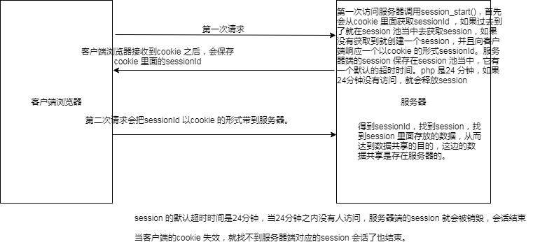

## HTTP服务&AJAX编程

###作业

#### php 部分

#### 注册 往数据库里面添加一条记录

```
/*
响应的数据
*/
header('Content-Type:text/json;charset=utf-8');
/*
连接数据库
账号，密码
*/
$con = mysql_connect("127.0.0.1","root","");
if (!$con){
	die('Could not connect: ' . mysql_error());
}
//连接那个数据
mysql_select_db("kaikeba", $con);
 //sql 语句
//把客户端获取到的值，往数据库里面添加
$sql="INSERT INTO teacher (username, telephone, age,t_desc); VALUES('$_POST[username]','$_POST[telephone]','$_POST[age]','$_POST[desc]','$_POST[lifephoto]')";
//通过连接发送sql语句;     
if (!mysql_query($sql,$con)){
 	die('Error: ' . mysql_error());
};
//关闭跟数据库的连接
mysql_close($con);
```

#### 登录 (从数据库里面查询一条记录)

```
 //给客户端一个响应头，响应json 格式的数据.
 header('Content-Type:application/json;charset=utf-8');
//连接数据库 得到连接
 $con = mysql_connect("127.0.0.1","root","");
 if (!$con){
   die('Could not connect: ' . mysql_error());
}
//连接那个数据库  pdj 数据
mysql_select_db("pdj", $con);
$result = mysql_query($sql);
//定义了一个空数组.
$list = array();
$total = 0;
//把数据库里面返回的结果$result 遍历出来
//放在$list 空的数据里面.
while($row = mysql_fetch_array($result)){
$item = array(
    'id' => $row['id'],
    'username' => $row['username'],
    'telephone' => $row['telephone'],
    'age' => $row['age'],
    't_desc' => $row['t_desc'],
    'lifephoto' => $row['lifephoto'],
);
//往数组里面添加一条记录.
array_push($list,$item);
//总记录数
$total = $row['total'];
}
echo "<a href=''>kaikeba</a>";
mysql_close($con);
```

#### 修改密码 (更改数据库的数据);

## cookie

### cookie 概念

​	什么是Cookies（“小甜饼”）呢？简单来说，Cookies就是服务器暂时存放在你的电脑里的资料（.txt格式的文本文件），好让服务器用来辨认你的计算机。当你在浏览网站的时候，Web服务器会先送一小小资料放在你的计算机上，Cookies 会把你在网站上所打的文字或是一些选择都记录下来。当下次你再访问同一个网站，Web服务器会先看看有没有它上次留下的Cookies资料，有的话，就会依据Cookie里的内容来判断使用者，送出特定的网页内容给你。 


服务端：怎么发送cookie (setcookie() 函数用于设置 cookie );

```
向客户端设置cookie
setcookie("user", "Alex Porter", time()+3600); 服务端向客户端设置cookie
获取客户端的cookie
$_COOKIE
```

客户端：怎么获取cookie

 var cookies=document.cookie;

###cookie 的使用以及生命周期

cookie 在客户端的存活时间. 内存cookie,硬盘cookie，追杀cookie

##### 内存cookie

```
setcookie("user", "zhuwu");  如果不设置时间，默认就是内存cookie ，当浏览器关闭，客户端会把cookie 清空，整个周期在浏览器的内存当中。
```

##### 硬盘cookie

```
header("Content-Type:text/html;charset=utf-8");
//设置当前cookie 的时间为一天。
setcookie("user", "zhuwu",time()+3600*24);
echo "php cookie";
```

##### 追杀cookie

```
把cookie 的value 设置为空，失效时间改成-1 这样即是追杀cookie，把客户端成cookie 清楚。
setcookie("user", "",-1);
```

###具体作用:

​		http 协议是基于请求响应的协议，请求-->响应，连接断开。没有办法记录客户端的状态。也就没有办法对用户的行为进行跟踪，我们可以根据cookie 对用户进行状态的跟踪,。

cookie流程：当第一次访问服务器，服务器可以向客户端发送cookie，可以往cookie 当中存入需要的数据。

客户端如果接收到服务器端响应的cookie，会把cookie 自动保存起来。当客户端再次请求服务器的时候，

浏览器会自动把客户端cookie 的数据发送到服务器。

作业：domain，path，httponly, 具体含义.

### cookie 的原理

setcookie("user", "zhuwu");   响应的时候会给客户端一个 set-Cookie 的响应头.

请求的时候客户端浏览器会给服务器一个cookie 的请求头

因为它们都是http 协议的规范，所以浏览器和服务器都会按照规则去进行解析。

案例：记住用户名。

## session

### session 概念

session  代表的就是一次会话。会话在我们的现实过程当中有很多，

比如我们拨打10086，在10086，当10086 接通时，代表我的会话开始，中间我可能发送多次动作交谈，直至挂断，会话结束。整个会话过程当中，我们可能会发送多次请求。由多次请求组成一次会话。

会话：是由多次请求组成,会话什么时候开始，会话什么时候结束.

那什么代表我们的网站会话嘞，我们可以这么理解，打开网站，访问我的网站时会话开始，在这个网站当中我可能发送多次请求，直至关闭浏览器会话结束。这整个过程当中我们可以理解成一次会话.

我们打开浏览器，访问一个网站的页面，会话开始，在这个网站这个过程当中，请求多个页面，发送多个请求，

直至我关闭浏览器，会话结束.，我们通常情况下需要在一个会话的范围内进行数据共享.

http 协议是基于请求响应的，无状态的，一次会话当中包含多个请求，每个请求都是相互独立的，会话当中包含多个请求，我们需要在请求之间共享数据，所以这个时候，我们就需要使用到会话。

###session 的使用

​    我们可以在一个站点发送两次请求，我们知道每个请求都是独立的，他们是不能共享数据，这个时候我们使用session 会话，让两个请求之间可以共享数据。

php 服务器端创建会话:

```
session_start();  会话开始
$_SESSION[]	 往改数组里面保存数据。	
session 的 默认时间在php 里面是24 分钟。
```

###session 的原理




#### 实际应用

保存用户登录的状态，当我登录的时候，如果登录成功，服务器把user 保存在session 当中。

#### cookie 与session 对比

cookie    cookie 是存储在客户端，它是服务器向客户端保存数据。记住用户名。

sessionStroage

客户端的存储，基于html5 ，也是本地存储。生命周期。

localstorage

本地存储，它是实例化到本地的硬盘。

session 

存储在服务器的，依赖cookie。

### 作业


1：cookie   path ,httpOnly, domain 的作用

2：举例session ，cookie ，localStroage，sessionStroage 的场景


​		

​	

​		


