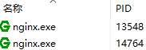
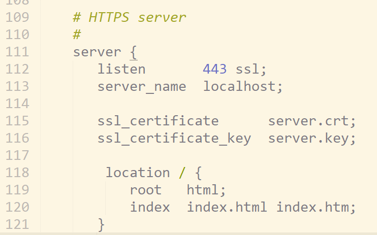
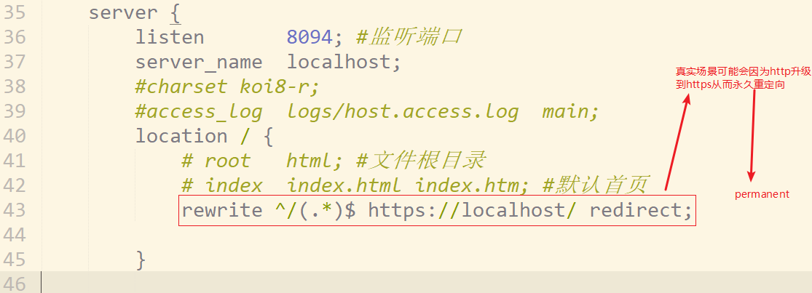

###  

### nginx基本使用

1. 以管理员运行命令行

2. cd 到nginx根目录 启动 ```启动命令:start nginx```

3. 在任务管理器看到两个 说明启动了,其中一个是主进程,一个是工作进程

4. 相关常用命令(nginx根目录)

   * ``` python
     nginx -c /path/to/nginx.conf  #以特定目录下的配置文件启动nginx:

     nginx -s  reload  #修改配置后重新加载生效

     nginx -s  reopen   #重新打开日志文件

     nginx -s stop  #快速停止nginx,暴力停止,可能造成数据丢失

     nginx -s quit  #完整有序的停止nginx

     nginx -t    #测试当前配置文件是否正确

     nginx -t -c /path/to/nginx.conf #测试特定的nginx配置文件是否正确
     ```

### nginx配置https  

1. 解压nginx.zip
2. 运行setup-x86_64.exe 安装cygwin 
3. 通过命令行运行C:\cygwin64\bin目录下的openssl.exe
4. 生成证书(管理员方式打开命令行)


```python
# 1、首先，进入你想创建证书和私钥的目录，例如：nginx/config目录
cd D:\\dev\\nginx-1.13.12\\conf

# 2、创建服务器私钥，命令会让你输入一个口令：
openssl genrsa -des3 -out server.key 1024

# 3、创建公钥（CSR）：
openssl req -new -key server.key -out server.csr

# 4、不用输入密码
cp server.key server.key.org
openssl rsa -in server.key.org -out server.key

# 5、最后标记证书使用上述私钥和公钥：
openssl x509 -req -days 365 -in server.csr -signkey server.key -out server.crt
```


4. 配置nginx



5. 访问```https://localhost``` 即可显示 nginx目录下html下的index.html或者index.htm


#### 重定向

