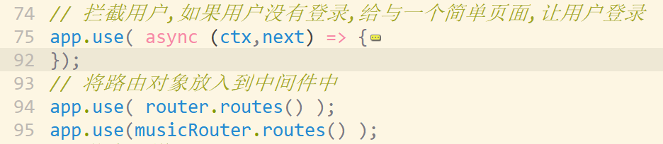

#### sql注入
* 早期后端程序员是根据sql + 用户的输入拼接最终sql,进行查询
    - ```select * from users where username = 'xxx' or 1=1```
    - 以上sql 用于完全根据用户输入拼接,会查询到过多数据
* 使用mysql的驱动包
    - 其中有对于数据的预编译机制
    - ```db.q('select * from users where usename = ?',['xxx or 1=1'])```
    - mysq会讲起作为转换,如果存在多余的引号之类的,会转换为 \'


#### session配置


#### 总结

* 登录和注册
* session是难点 ..实际应用,照抄就可以了 
  * 扩展: koa-seession  机制中默认不包含 session数据,cookie作为标识来取(express包含)
  * 不配置store  就会将数据作为cookie来发送,不安全
    * cookie以外的存储数据: 1: 内存 /  2:存储在数据库中
* 首页的显示||添加页面||....
  * 需要判断用户是否登录
    * 将统一操作配置在中间件中完成
    * 但是中间件配置的位置要注意顺序
    * 
* 渲染: extend + block 'content'
* 上传音乐
  * 选择工具中的form-data,   建议大家基础不是太好的情况,先不必管__拦截登录和session服务器存储__


